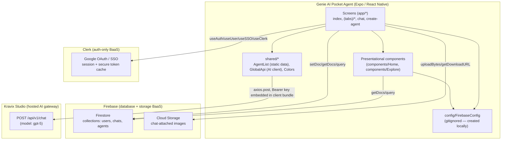
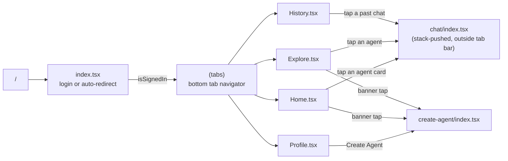
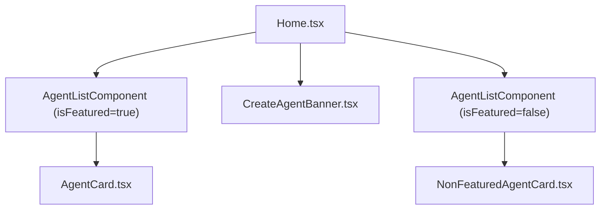
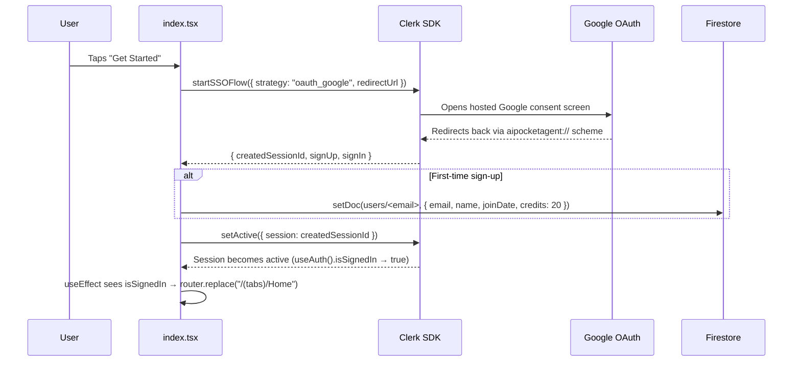
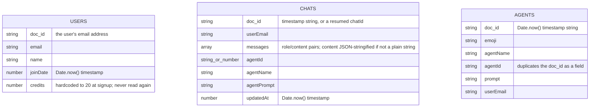
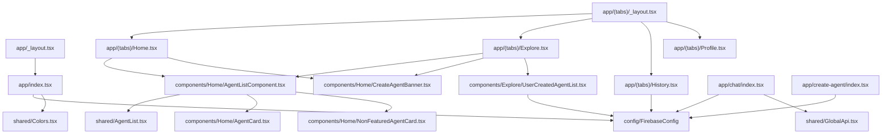

# DEVELOPER.md — Genie AI Pocket Agent Technical Handbook

> Written for the returning maintainer. Read this before touching the code. It explains the *why*, not just the *what*.
>
> A defining architectural fact about this project, worth internalizing before anything else: **Genie AI Pocket Agent is a React Native / Expo mobile app that stitches together three separate, independent third-party services from the client** — Clerk (auth), Firebase (database + file storage), and a third-party hosted AI gateway called Kravix Studio — with no backend of its own at all, and no single unifying wrapper layer over any of them. Each screen talks to whichever provider's SDK it needs directly.

---

## 1. Project Overview

**Genie AI Pocket Agent** is a mobile chat app (iOS/Android/Web via Expo) built around the concept of "AI agents" — reusable persona/system-prompt combinations a user can chat with. It ships with 12 hardcoded preset agents (Writing Assistant, Translator, Math Solver, Code Assistant, etc.) and lets a signed-in user create their own custom agents (a name + emoji + free-text instruction). Every agent, preset or custom, opens the same chat screen, which sends the conversation to a hosted AI API and persists the transcript for later retrieval under a chat history tab.

**Primary purpose:** a lightweight, general-purpose "pick a persona, then chat with it" mobile assistant, distinguished by supporting many interchangeable agent personalities — both built-in and user-generated — rather than being a single-purpose tool built around one fixed task.

**Major capabilities:**
- Google sign-in via Clerk's hosted OAuth/SSO flow (no app-owned password/account system).
- A catalog of 12 built-in agents with prewritten system prompts, split into "featured" and "non-featured" tiers for layout purposes.
- User-created custom agents (name, emoji, instruction), stored per-user in Firestore.
- A chat interface supporting text and (optionally) one attached image per message, sent to an AI provider and rendered with markdown-free plain text.
- Persistent chat history per user, resumable from a dedicated History tab.
- Copy-to-clipboard for AI responses.

**Overall architecture:** a **client-only mobile app with three independent Backend-as-a-Service integrations**, and no code the developer owns for auth, database, or AI inference:
- **Clerk** (`@clerk/clerk-expo`) — authentication only (Google OAuth via SSO).
- **Firebase** (Firestore + Storage) — the app's entire database and file storage.
- **Kravix Studio** (`kravixstudio.com`) — a hosted third-party AI chat-completion gateway, called directly from the mobile client via a plain `axios` POST.

**Technologies used:** Expo SDK 54 + Expo Router (file-based routing) + React Native 0.81 + TypeScript, React Navigation's bottom-tabs under the hood, `lucide-react-native` for icons, `rn-emoji-keyboard` for the custom-agent emoji picker, `expo-image-picker` for attaching photos, `expo-clipboard` for copy actions.

**High-level design philosophy:** minimize app-owned infrastructure by delegating each concern to the BaaS provider best suited to it — Clerk for identity, Firebase for persistence, and an already-hosted AI gateway for inference — rather than either self-hosting a backend or funneling everything through one unifying SDK wrapper. The cost of this split is that there is no single abstraction layer unifying access to these providers — each screen talks to whichever provider's SDK it needs directly, so the same kind of "auth check" or "data fetch" pattern is hand-rolled independently, per screen, three times over instead of once.

---

## 2. Repository Structure

```
genie-ai-pocket-agent-main/
├── app.json                  # Expo app config: name, scheme, icons, splash, plugins
├── app/                        # Expo Router file-based routes (screens)
│   ├── _layout.tsx              # Root layout: wraps the whole app in ClerkProvider
│   ├── index.tsx                  # First screen: Google-login landing page / auth redirect
│   ├── (tabs)/                      # Route group → bottom tab navigator
│   │   ├── _layout.tsx                # Tab bar definition (4 tabs)
│   │   ├── Home.tsx, Explore.tsx, History.tsx, Profile.tsx
│   ├── chat/index.tsx                # Dynamic chat screen (driven entirely by route params)
│   └── create-agent/index.tsx          # Custom-agent creation form
├── components/                 # Reusable, mostly presentational UI
│   ├── Home/                     # Agent grid cards + the "create your own" banner
│   └── Explore/                    # The signed-in user's own custom-agent list
├── shared/                       # Cross-screen logic/config, NOT UI
│   ├── AgentList.tsx                # The 12 hardcoded preset agents (name, prompt, image, type)
│   ├── Colors.tsx                     # App-wide color constants
│   └── GlobalApi.tsx                    # The one function that calls the external AI API
├── assets/images/                  # All app artwork (agent icons, splash/app icons, decorative images)
└── config/                           # NOT PRESENT IN THIS REPO — see below
```

### `config/` (gitignored — you must create this yourself)
**Why it doesn't exist in the checked-out repo:** `.gitignore` explicitly excludes `/config/`. Every screen that touches Firestore or Storage imports `firestoreDb`/`storage` from `@/config/FirebaseConfig`, but that file is never committed — it must be created locally (or provisioned via CI secrets) following the Firebase setup steps in `README.md`. **This means the project will not build or run out of the box until this file is created.** See [§14 Environment Variables](#14-environment-variables) and [§23 Common Pitfalls](#23-common-pitfalls).

### `app/`
**Why it exists:** Expo Router turns this folder's structure directly into the app's navigation graph — a file here *is* a route, with no separate router-configuration file to maintain. `(tabs)` is a **route group** (parentheses mean the segment doesn't appear in the URL/path) that scopes four screens under a shared bottom-tab layout. `chat/` and `create-agent/` are **stack-pushed** screens reachable from any tab, deliberately kept outside the `(tabs)` group so they render full-screen without the tab bar.

### `components/`
**Why it exists:** Presentational pieces reused across `Home.tsx` and `Explore.tsx` (`AgentListComponent`, `AgentCard`, `NonFeaturedAgentCard`, `CreateAgentBanner`) plus the one component that fetches a user's *own* agents from Firestore (`UserCreatedAgentList`). **What should never belong here:** route-level navigation param handling — components read data via props or their own scoped Firebase queries, but they don't own the "which screen am I" logic.

### `shared/`
**Why it exists:** anything that isn't a component and isn't a route, but is used by more than one of them. `AgentList.tsx` is pure static data (no logic). `GlobalApi.tsx` is the *only* place `axios` or the AI provider's URL appears in the codebase — if the AI provider ever changes, this is the one file to touch. `Colors.tsx` is the entire design-token system for the app (there's no Tailwind/theme file here, since this is React Native, not a web project — styling is inline `StyleSheet`/style-object based throughout).

### `assets/images/`
**Why it exists:** Expo's `require(...)`-based static asset system needs images to be file-system-resolvable at build time — every agent's icon, the login illustration, and all platform icon variants (Android adaptive icon layers, splash icon, favicon for the web build) live here.

---

## 3. Architecture Overview



**Major layers:** there are really only two — **screens** (which own all data-fetching/mutation — a strict "only screens call out to a backend service" rule, except here there are three different SDKs being called instead of one unifying store) and **presentational components** (which either receive props or, in a couple of cases, perform their own narrowly-scoped Firestore reads — see `UserCreatedAgentList`, a partial exception to strict prop-drilling).

**Separation of concerns:**
- **Identity** is 100% Clerk's responsibility — the app never stores a password, never issues its own session token, and reads the current user exclusively through Clerk's React hooks (`useAuth`, `useUser`, `useClerk`, `useSSO`).
- **Persistence** is 100% Firebase's responsibility — Firestore for structured data (users, chats, custom agents), Cloud Storage for binary chat attachments.
- **Inference** is 100% Kravix Studio's responsibility — this app sends a message array and gets back a completion; it has no model-hosting, no prompt-orchestration server, and no rate-limiting of its own.

**Dependency direction:** `app/* (screens) → components/* and shared/*`; `components/* → shared/Colors` only (never the reverse); `shared/GlobalApi.tsx` and `config/FirebaseConfig` are leaf nodes with no dependency on anything else in the app. There is, notably, **no shared "data layer" module** wrapping Firestore calls — each screen that needs Firestore imports `firestoreDb` directly and writes its own `query`/`where`/`getDocs` calls inline (see [§19](#19-important-design-decisions) and [§24 Technical Debt](#24-technical-debt)).

---

## 4. Execution Flow

### App startup
1. Expo's entry point is `expo-router/entry` (declared in `package.json`'s `"main"`), which boots Expo Router and renders `app/_layout.tsx` as the root.
2. `_layout.tsx` wraps everything in `<ClerkProvider tokenCache={tokenCache}>` — the `tokenCache` (imported from `@clerk/clerk-expo/token-cache`) is what persists the Clerk session securely across app restarts, backed by `expo-secure-store` under the hood (this is why `expo-secure-store` is a listed dependency even though no app code imports it directly — it's a transitive requirement of Clerk's own token-caching mechanism, not dead weight).
3. A `<Stack>` with `headerShown: false` globally, explicitly declaring only one screen (`index`) via `<Stack.Screen name="index" />`. **This does not mean other routes are unreachable** — Expo Router auto-registers every file under `app/` as a navigable route regardless of whether it's explicitly listed in a `<Stack>`; an explicit `<Stack.Screen>` entry is only needed to *override* that screen's default options (as `(tabs)/_layout.tsx`, `chat/index.tsx`, and `create-agent/index.tsx` each do locally, via `navigation.setOptions(...)` inside their own component instead of via the root `Stack`).
4. `app/index.tsx` renders first. It reads `useAuth().isSignedIn` — if `true`, it immediately `router.replace("/(tabs)/Home")`s away; if the user isn't signed in, it renders the Google-login landing screen (illustration + "Get Started" button) instead.

### Sign-in flow (`app/index.tsx`)
1. `useWarmUpBrowser()` — an Android-only optimization (pre-warms the in-app browser used for the OAuth redirect; no-ops and cleans up on unmount for any other platform).
2. Tapping "Get Started" calls `startSSOFlow({ strategy: "oauth_google", redirectUrl: AuthSession.makeRedirectUri() })` — Clerk opens Google's OAuth consent screen, then redirects back into the app via its `aipocketagent://` URL scheme (declared in `app.json`'s `"scheme"` field).
3. On first-ever sign-up (`signUp` is present in the SSO result), the app writes a `users/<email>` Firestore document with `email`, `name`, `joinDate`, and a `credits: 20` field. **`credits` is written once here and never read, decremented, or checked anywhere else in the codebase** — see [§23 Common Pitfalls](#23-common-pitfalls).
4. On success, `setActive()` activates the new Clerk session; the app then simply `router.push("/")`, which re-triggers step-1's `isSignedIn` check in `index.tsx` and redirects to `(tabs)/Home`.

### Tab navigation startup (`(tabs)/_layout.tsx`)
A plain `<Tabs>` from `expo-router`, with four `<Tabs.Screen>` entries (Home, Explore, History, Profile), each given a `lucide-react-native` icon. No custom tab-bar styling or badge logic — this is Expo Router/React Navigation's default bottom-tab chrome.

---

## 5. Request Lifecycle

There is no server-side request lifecycle owned by this project. The equivalent lifecycle, repeated independently for each of the three external services, is:

```
User action in a screen (app/*.tsx)
    ↓
Direct call to the relevant SDK:
    - Clerk hook (useAuth / useUser / useSSO / useClerk)
    - Firebase call (setDoc / getDocs / query+where / uploadBytes / getDownloadURL)
    - axios.post to Kravix Studio (via shared/GlobalApi.tsx)
    ↓
Provider's own network/session handling (opaque to this app)
    ↓
Response handled inline in the calling screen's own try/catch (where present)
    ↓
Local useState update → re-render
```

**Worked example: sending a chat message (`app/chat/index.tsx`'s `onSendMessage`)** — the most complex single operation in the app:
1. Guard: if `input` is empty, or `docId` hasn't been assigned yet, bail out (showing a toast in the latter case).
2. If an image was picked (`file` state is set): `UploadImageToStorage()` uploads it to Firebase Storage under `ai-pocket-agent/<timestamp>.png` and resolves a public download URL; the outgoing message's `content` becomes an array (`[{type:"text",...}, {type:"image_url",...}]`) rather than a plain string.
3. An **optimistic UI update**: the new user message *and* a placeholder assistant message (`content: "⏳ Loading..."`) are both appended to local `messages` state immediately, before the AI call resolves.
4. `AIChatModel(updatedMessages)` (from `shared/GlobalApi.tsx`) POSTs the entire message array to Kravix Studio.
5. The response is defensively unwrapped across four possible shapes (plain string / `{aiResponse: string}` / `{aiResponse: {content}}` / fallback "no response" message) — see [§9](#9-api-documentation) for why this defensiveness exists.
6. The placeholder message is replaced in-place (by array index) with the real response.
7. A **separate** `useEffect`, watching `messages`, fires on *every* change to that array (meaning it fires twice per sent message — once for the optimistic update, once for the final replacement) and writes the entire message list back to Firestore under `chats/<docId>`, `merge: true`.

**No authorization check gates any of this beyond "is a Clerk user present."** There is no server-side validation that the `docId` being written belongs to the calling user, nor any check that the `agentId`/`agentPrompt` being used actually belongs to that user for custom agents — the client simply trusts whatever it's given via route params.

---

## 6. Frontend Flow

### Routing (`app/` directory structure, per Expo Router conventions)


**Auth gating:** unlike both prior projects, there is **no per-screen auth-redirect pattern** repeated across `(tabs)/*` — the gate happens exactly once, in `app/index.tsx`, which is the only screen a signed-out user can ever land on (there's no deep-link protection preventing a signed-out session from being navigated straight to `/chat` in principle, but nothing in the UI offers that path without first passing through `index.tsx`'s redirect).

**Navigation-params-as-data-transport:** this app has no dedicated "fetch by ID" step for opening a chat — instead, **the entire agent context (name, prompt, id) and, when resuming from history, the full prior message list are passed as route params** via `router.push({ pathname: "/chat", params: {...} })`. `chat/index.tsx` never independently queries Firestore for "what is this agent" — it only ever knows what was handed to it via `useLocalSearchParams()`. This is a meaningfully different pattern from always re-fetching canonical data by ID from the data source on the destination screen, and it has real consequences — see [§23 Common Pitfalls](#23-common-pitfalls).

**Rendering:** standard React Native rendering (no SSR concept applies here — the "web" Expo target does a static export, but that's a build concern, not a runtime data-fetching concern).

**State management:** every screen uses local `useState` for its own data (`Home`'s implicit list via `AgentListComponent`, `Explore`'s `agentList`, `History`'s `historyList`, `chat`'s `messages`/`input`/`file`/`docId`, `create-agent`'s form fields). The only cross-screen "state" is Clerk's own `useUser()`/`useAuth()`, which Clerk's context provides globally without this app needing its own store — there is **no Redux, no Zustand, no Context API usage written by this app** at all, appropriate given how little state genuinely needs to be global in a tab-based mobile app.

**Component hierarchy for the Home tab:**

`AgentListComponent` reads from the single static `Agents` array (`shared/AgentList.tsx`) and filters by `item.featured === isFeatured` — it is used identically (just with the opposite boolean) to render both the "hero" grid and the "more agents" grid on the Home tab, and reused a third time on the Explore tab.

---

## 7. Authentication & Authorization

**Mechanism:** Google OAuth via Clerk's hosted SSO flow (`useSSO().startSSOFlow`). There is no email/password option implemented in this codebase (the README documents Clerk setup specifically "to enable Google Login").



**Session persistence:** entirely Clerk's responsibility, using `expo-secure-store` (native encrypted storage) via the `tokenCache` passed to `ClerkProvider` — this app never reads, writes, or inspects the session token itself.

**Authorization model:** there is **no server enforcing per-user data access** — the entire "a user can only see their own chats/agents" guarantee rests on:
1. Client-side query filters: every Firestore read for chats or custom agents uses `where("userEmail", "==", user?.primaryEmailAddress?.emailAddress)`.
2. Whatever Firestore Security Rules are configured directly in the Firebase console for this project — **no `firestore.rules` file (or any rules file) exists anywhere in this repository**, so the actual server-side enforcement (or lack thereof) cannot be audited from source. **Assumption (medium confidence):** rules are configured out-of-band in the Firebase console; if they are permissive (e.g., "any authenticated user can read/write any document"), then the client-side `where` filter is the *only* thing preventing one user from seeing another's chats/agents by directly crafting a different query — which a modified client or direct Firestore REST call could bypass entirely, since the identity used in the filter (`userEmail`) is just a string the client supplies, not something Firestore Rules can verify came from Clerk without custom rule logic referencing a trusted claim.

**No role system, no permissions tiers.** The `credits: 20` field set at sign-up strongly implies an intended free/paid usage-limiting tier system that was never implemented (see [§23](#23-common-pitfalls), [§24](#24-technical-debt)) — currently every signed-in user has unlimited access to the chat/AI feature regardless of that field's value.

---

## 8. Database Documentation

**Firestore** is the sole "database," accessed directly from the client with no intermediary. There are three collections, inferred entirely from the `setDoc`/`getDocs`/`collection(...)` call sites in the code (Firestore is schemaless — there is no schema file to read instead):



**Why `users` keys by email instead of Clerk's UUID:** every downstream query (chats, agents) also filters by `userEmail`, not a Clerk user ID — this keeps every collection joinable by the same human-readable key without needing to look up a UUID first, at the cost of breaking silently if a user's email ever changes (Clerk supports this; this app does not appear to handle it — a new email would look like a brand-new, historyless user).

**Why `chats` and `agents` are top-level collections rather than subcollections of `users`:** simpler `collection(...)`/`where(...)` queries (no need to know a parent document path ahead of time), at the cost of every query needing an explicit `userEmail` filter to scope results — the classic trade-off of flat collections filtered by a foreign-key-like field versus true nested ownership.

**No centralized type definitions.** This project defines the "shape of a chat" and "shape of an agent" **independently, per file, with inconsistent field sets**, rather than in one shared types module: `app/(tabs)/History.tsx` declares its own local `History` type; `components/Explore/UserCreatedAgentList.tsx` declares its own local `Agent` type (different fields than the `Agent` type exported from `components/Home/AgentCard.tsx`, which describes the *hardcoded catalog* shape, not the *Firestore-backed custom agent* shape — two different things share the same type name); `app/chat/index.tsx` declares its own local `Message` type. There is no single source of truth for "what does a chat document look like" — see [§24 Technical Debt](#24-technical-debt).

**No migrations, no indexes visible in source** (Firestore composite indexes, if any exist for the `where` queries used here, would be configured in the Firebase console and are not represented in this repository).

**Firebase Storage** holds only chat-attached images, under the flat path prefix `ai-pocket-agent/<timestamp>.png` — no per-user folder structure, meaning (absent Storage security rules not present in this repo either) any signed-in user's uploaded images could, in principle, share a discoverable path pattern with another's.

---

## 9. API Documentation

There is no API this project owns. The one meaningful external API surface — beyond Clerk's and Firebase's own opaque SDKs — is the AI provider, documented in full since it's the entire contents of `shared/GlobalApi.tsx`:

### `POST https://kravixstudio.com/api/v1/chat` (via `AIChatModel(messages)`)
- **Purpose:** the single AI inference call for every chat message, regardless of which agent (preset or custom) is active.
- **Auth:** `Authorization: Bearer <EXPO_PUBLIC_KRAVIX_STUDIO_API_KEY>` — a client-embedded key (see [§14](#14-environment-variables) and [§16 Security](#16-security) for why this is a meaningful concern, not just a style note).
- **Request body:** `{ message: <the full messages array, including the "system" role prompt>, aiModel: "gpt-5", outputType: "text" }`. Both `aiModel` and `outputType` are **hardcoded constants** in `GlobalApi.tsx` — they are not parameterized per call, meaning every agent (including the "Image Generator" preset, whose catalog entry declares `type: "image"`) makes the identical request shape; there is no code path that ever requests `outputType: "json"` or an image-generation mode. See [§10](#10-business-logic) and [§23 Common Pitfalls](#23-common-pitfalls).
- **Response handling:** `chat/index.tsx` defensively branches across four possible response shapes (a bare string; `{ aiResponse: string }`; `{ aiResponse: { role, content } }`; or none of the above, in which case a hardcoded fallback message is shown). This defensiveness suggests the Kravix Studio API's response shape has been observed to vary (possibly across different underlying models it proxies to), and the client has been hardened against that inconsistency rather than the app relying on the provider to ever change its contract.
- **Errors:** any thrown error (network failure, non-2xx response, etc.) is caught in `onSendMessage`'s `try/catch` and replaces the optimistic "⏳ Loading..." bubble with a static `"❌ Internal Server Error"` message — no retry, no distinction between error types shown to the user.

### Firebase calls (not a REST API from this app's perspective, but the closest thing to one)
- `setDoc(doc(firestoreDb, "users", email), {...})` — create/overwrite a user profile on first sign-up.
- `setDoc(doc(firestoreDb, "chats", docId), {...}, { merge: true })` — upsert a chat transcript; called on every change to the in-memory `messages` array during an active chat.
- `getDocs(query(collection(firestoreDb, "chats"), where("userEmail","==",...)))` — list a user's chat history (`History.tsx`).
- `setDoc(doc(firestoreDb, "agents", agentId), {...})` — create a custom agent (`create-agent/index.tsx`).
- `getDocs(query(collection(firestoreDb, "agents"), where("userEmail","==",...)))` — list a user's own custom agents (`UserCreatedAgentList.tsx`).
- `uploadBytes(ref(storage, "ai-pocket-agent/<ts>.png"), blob)` + `getDownloadURL(...)` — upload a chat-attached image and obtain a public URL for it.

### Clerk calls (opaque SDK, not documented here beyond usage sites)
`useAuth()`, `useUser()`, `useClerk().signOut()`, `useSSO().startSSOFlow()` — used across `index.tsx`, `Profile.tsx`, and implicitly by `ClerkProvider` itself.

---

## 10. Business Logic

**Core concept — "an agent is just a system prompt plus metadata."** Both preset agents (`shared/AgentList.tsx`, hardcoded, `featured: true/false`, includes an `image`, `initialText` suggestion, and a `type` classification) and user-created agents (Firestore `agents` collection: emoji, name, prompt) ultimately collapse to the exact same three fields the chat screen actually consumes: `agentName`, `agentPrompt`, `agentId`. Everything else attached to a preset agent — its `image`, `initialText`, and especially its `type` field (`"chat" | "image" | "translation" | "image+text"`) — **is display-only metadata on the catalog card and is never read again once the user taps into a chat.** This means the app's "specialized agent types" are cosmetic groupings for the catalog UI rather than functionally distinct behaviors — every agent, regardless of declared `type`, drives the identical generic text-chat flow against the identical `outputType: "text"` AI request. See [§23 Common Pitfalls](#23-common-pitfalls) for the concrete unused fields this produces.

**Key assumptions:**
- A chat "belongs" to exactly one agent for its entire lifetime — there's no mechanism to switch agents mid-conversation (each new agent tap always starts a route navigation with a fresh or resumed `docId`, but always with one fixed `agentPrompt` injected as the lone `system` message).
- A resumed chat (opened from History) trusts the `messagesList` route param as authoritative, rather than re-fetching from Firestore by `chatId` — see [§23](#23-common-pitfalls) for the staleness implication.
- Image attachments are always paired with the user's own message (never sent standalone, never attached to agent/system messages).
- The `system` role message (the agent's prompt) is filtered out of the rendered chat UI (`if (item.role === "system") return null`) but is still included in every request sent to the AI provider and is still persisted into the `messages` array saved to Firestore — meaning every stored chat document's `messages[0]` is effectively a duplicate of `agentPrompt`, which is *also* stored as its own top-level field on the same document.

**Important algorithm — the docId assignment logic (`chat/index.tsx`):** on mount, if a `chatId` param was passed (opening from History) and isn't the literal string `"undefined"`, it's reused as the Firestore document ID; otherwise, a new ID is minted as `Date.now().toString()`. This is a millisecond-precision timestamp, not a UUID — see [§23 Common Pitfalls](#23-common-pitfalls) for the collision implication.

---

## 11. Data Flow

**Example: creating a custom agent and immediately trying it (`create-agent/index.tsx`)**

```
User fills in emoji + name + instruction, taps "Create Agent"
    ↓
Client-side presence validation (Alert if any field missing)
    ↓
agentId = Date.now().toString()
    ↓
setDoc(agents/<agentId>, { emoji, agentName, agentId, prompt: instruction, userEmail })
    ↓
Firestore persists the document
    ↓
Alert.alert(...) with two actions: "Ok" (dismiss) or "Try Now"
    ↓ (if "Try Now")
router.push({ pathname: "/chat", params: { agentName, initialText: "", agentPrompt: instruction, agentId } })
    ↓
chat/index.tsx receives the agent's data purely via route params — no re-fetch from Firestore
    ↓
The agentPrompt becomes the chat's system message; user can now converse with their new agent
```

**Example: the chat message round-trip** (see [§5](#5-request-lifecycle) for the full sequence) — the key transformation points are: `input` (plain string) → optionally wrapped into a structured `content` array if an image is attached → sent as part of the full `messages` array to Kravix Studio → the AI's raw, shape-varying response is normalized into a single `{role, content}` object → appended to `messages` → **serialized a second time** for Firestore storage (any non-string `content`, i.e. the image-attachment array shape, is `JSON.stringify`'d before being written, and would need to be `JSON.parse`'d back out by any future reader — `History.tsx` does not do this when displaying `item.messages[item.messages.length - 1]?.content` as preview text, meaning a history preview for a chat whose last message included an image will show a raw JSON string instead of readable text; see [§23 Common Pitfalls](#23-common-pitfalls)).

---

## 12. State Management

**Frontend (there is no backend state to speak of):**
- **Implicit global (Clerk's own context):** `isSignedIn`, `user` — available anywhere via `useAuth()`/`useUser()` without this app writing any store code.
- **Local (`useState`), per screen:** everything else. No screen's local state is ever read by another screen directly — all cross-screen data handoff happens via **route params** (see [§6](#6-frontend-flow)) or via a fresh Firestore query on the destination screen's mount.
- **No persistent client-side cache, no `localStorage`/`AsyncStorage` usage for app data** (React Native has no `localStorage`; the only persisted, encrypted, non-Firestore state is Clerk's own session token via `expo-secure-store`, which this app's code never touches directly).

**Backend:** not applicable in the traditional sense; Firestore itself is the only "server-side" state, and it has no server-side logic (no Cloud Functions, no triggers) evident anywhere in this repository — every write is a direct client `setDoc` call.

---

## 13. External Services

| Service | Purpose | Integration point | Notes |
|---|---|---|---|
| **Clerk** (`@clerk/clerk-expo`) | Authentication (Google OAuth/SSO), session persistence | `app/_layout.tsx` (`ClerkProvider`), `app/index.tsx`, `app/(tabs)/Profile.tsx` | The app never sees a raw password or an app-issued token; all identity concerns are Clerk API calls via React hooks. Requires a Clerk **publishable key** to function — **not referenced anywhere in this app's source**, meaning it is almost certainly expected to be supplied via an `EXPO_PUBLIC_CLERK_PUBLISHABLE_KEY` environment variable per Clerk's standard Expo SDK convention (Clerk's `ClerkProvider` can read this automatically without an explicit prop). *(Assumption, medium confidence — could not be verified against installed SDK source, which isn't included in this archive.)* |
| **Firebase** (Firestore + Cloud Storage) | The entire application database and binary file store | `config/FirebaseConfig` (not present in repo — see [§2](#2-repository-structure)), imported by nearly every route/component that reads or writes data | Requires a full Firebase web-app config object (`apiKey`, `authDomain`, `projectId`, `storageBucket`, etc.) per the README's setup instructions — none of these values, nor a template for them, exist anywhere in this repository. |
| **Kravix Studio** (`kravixstudio.com`) | Hosted AI chat-completion gateway (proxying to, per its request field, a `gpt-5` model) | `shared/GlobalApi.tsx` | The only AI integration in the app; called via plain `axios`, authenticated with a bearer key read from `EXPO_PUBLIC_KRAVIX_STUDIO_API_KEY` — an `EXPO_PUBLIC_`-prefixed Expo environment variable, which means **its value is compiled directly into the client bundle and is extractable by anyone who has the built app** (see [§16 Security](#16-security)). |
| **Google** (OAuth provider) | Identity provider behind Clerk's `oauth_google` SSO strategy | Indirect, via Clerk | This app never talks to Google's APIs directly. |

No self-hosted database, no email provider, no payment provider, no push-notification service, and no Cloud Functions/serverless compute of the developer's own are present anywhere in this codebase.

---

## 14. Environment Variables

**Only one environment variable is referenced anywhere in the application source:**

| Variable | Purpose | Used in | Required | Production impact if missing |
|---|---|---|---|---|
| `EXPO_PUBLIC_KRAVIX_STUDIO_API_KEY` | Bearer-token auth for the AI chat endpoint | `shared/GlobalApi.tsx` | Yes, for any chat functionality | Every `AIChatModel` call will be rejected by Kravix Studio (missing/invalid auth), and the chat UI will show its generic `"❌ Internal Server Error"` fallback for every message sent. |

**No `.env` or `.env.sample` file exists anywhere in this repository**, and no other `process.env`/`EXPO_PUBLIC_*` reference appears in the codebase, despite the app clearly depending on at least two more pieces of external configuration that must be supplied some other way:
- **A Firebase config object**, consumed by the gitignored `config/FirebaseConfig` file — its required shape (`apiKey`, `authDomain`, `projectId`, `storageBucket`, `messagingSenderId`, `appId`, at minimum) is documented only in prose form in `README.md`'s "Firebase Setup" section, not as a checked-in template file.
- **A Clerk publishable key** — required for `ClerkProvider` to function at all, but never referenced by name anywhere in this app's source; almost certainly expected as `EXPO_PUBLIC_CLERK_PUBLISHABLE_KEY` by Clerk's own SDK convention (see [§13](#13-external-services)).

**Practical impact:** a fresh clone of this repository cannot be run at all without externally obtaining and supplying all three of these (Firebase config, Clerk key, Kravix Studio key) — none of which have a checked-in sample/template in this repo. See [§23 Common Pitfalls](#23-common-pitfalls).

---

## 15. Error Handling

**No centralized error-handling pattern exists in this codebase** — there is no uniform try/catch convention or shared error-state mechanism; error handling here is ad hoc and inconsistent per call site:
- `chat/index.tsx`'s `onSendMessage` wraps the AI call in `try/catch`, replacing the optimistic placeholder with a static error string on failure.
- `chat/index.tsx`'s Firestore-save `useEffect` wraps its write in `try/catch`, only `console.error`-logging failures — a failed save is entirely invisible to the user, who will believe their conversation was persisted when it may not have been.
- `UploadImageToStorage` catches its own errors, logs them, and returns `null` — the caller (`onSendMessage`) then proceeds to send the message *without* the image and without informing the user the upload failed.
- `create-agent/index.tsx`'s `CreateNewAgent` has **no try/catch at all** around its `setDoc` call — a Firestore write failure here would produce an unhandled promise rejection with no user-facing feedback whatsoever.
- `History.tsx` and `UserCreatedAgentList.tsx`'s data-loading functions have **no try/catch** — a query failure leaves the list silently empty (indistinguishable from "you have no history/agents yet") rather than surfacing an error.
- `app/index.tsx`'s sign-in handler catches and `console.error`s failures from `startSSOFlow`, showing no in-app feedback to the user beyond the button simply not navigating anywhere.

**No global error boundary** exists anywhere in the app (no top-level `ErrorBoundary` component) — an uncaught render-time error in any screen would surface as React Native's default red-screen developer error (in dev) or a hard crash (in a release build), with no graceful in-app fallback UI.

**Retries:** none, anywhere.

**Monitoring/logging:** `console.log`/`console.error` only, scattered inconsistently (some flows log verbosely with emoji-prefixed debug messages — e.g. `"🔥 Saving messages:"`, `"✅ Chat saved successfully in Firestore!"` — clearly left in from active debugging; others log nothing at all).

> **Note:** this section is purely about software error-handling architecture and does not touch personal well-being topics.

---

## 16. Security

**Client-embedded AI API key.** `EXPO_PUBLIC_KRAVIX_STUDIO_API_KEY` is read via `process.env` and used directly in a client-side `axios` call. Expo's `EXPO_PUBLIC_` prefix convention means this value is inlined into the JavaScript bundle at build time and shipped inside the compiled app (for every platform, including the static web export) — **it is not a secret once the app is built**, and anyone with access to the built app/bundle can extract it and make authenticated calls to Kravix Studio's API on the developer's own account/quota. This is the single most consequential security fact about this project — see [§24 Technical Debt](#24-technical-debt) for the fix (proxy AI calls through a small server-side function that holds the real key).

**No server-side authorization enforcement (as far as this repo can show).** As discussed in [§7](#7-authentication--authorization), Firestore access control depends entirely on Security Rules configured outside this repository. Because no rules file is checked in, there's no way to verify from source whether a malicious client could read/write another user's `chats`/`agents`/`users` documents by supplying a different `userEmail` in a hand-crafted query — this should be the first thing audited (in the Firebase console) before this app handles any sensitive data at scale.

**No input validation beyond presence checks.** `create-agent/index.tsx` only checks that fields are non-empty before writing to Firestore — no length limits, no content sanitization on the free-text `instruction` field, which is later interpolated directly as a system prompt sent to the AI provider (a user could write an arbitrary/adversarial system prompt for their own agent — low risk, since it only affects that user's own conversations with an agent only they can see/use, not any shared or cross-user resource).

**No secrets management for the Firebase config.** Firebase web-app config objects (API key, project ID, etc.) are commonly considered "not secret" in the sense that they're expected to ship in client bundles (Firebase's actual security boundary is Firestore/Storage Rules, not the config object's secrecy) — but this project's total lack of a checked-in template for that config, combined with no visible Rules file, makes it impossible to assess this project's real security posture from the repository alone.

**XSS/injection:** not generally applicable to React Native (no HTML rendering, no `dangerouslySetInnerHTML`-equivalent), so this class of risk that matters heavily for the two web projects is largely moot here.

---

## 17. Performance Considerations

**No pagination anywhere.** `History.tsx` and `UserCreatedAgentList.tsx` both fetch *all* matching documents for a user in one `getDocs` call — fine at small scale, the same posture as both prior projects.

**Duplicate Firestore writes per message.** As noted in [§5](#5-request-lifecycle) and [§10](#10-business-logic), the chat-save `useEffect` fires on every `messages` state change, meaning **two Firestore writes occur per single sent message** (once for the optimistic "Loading..." placeholder, once for the final response) — a straightforward, low-risk inefficiency that would double Firestore write costs/quota usage at any meaningful scale. Debouncing the save, or only saving once the AI response has actually resolved, would halve this.

**No image compression/resizing before upload** beyond `ImagePicker`'s `quality: 0.5` JPEG-style compression setting — a full-resolution photo (at 50% quality) is uploaded to Firebase Storage and displayed back at a fixed small `180x180` chat-bubble size, meaning bandwidth/storage cost is higher than the actually-displayed resolution requires.

**No caching of the AI response or the static Agents catalog** — `Agents` is a static in-memory array (no fetch cost at all, since it's bundled directly into the app), so this is a non-issue for the catalog; it only applies to Firestore reads, which are always re-fetched fresh on every screen mount.

**The AI call is the long pole**, identical in kind to both prior projects — no streaming, no timeout override; the user watches a spinner-in-a-chat-bubble (`⏳ Loading...` with an `ActivityIndicator`) until the full response arrives.

---

## 18. Dependency Graph



**Tightly coupled:** `chat/index.tsx` is implicitly coupled to *every other screen that navigates to it* (`AgentListComponent`, `UserCreatedAgentList`, `History.tsx`, `create-agent/index.tsx`) via the exact shape of the route params each must supply (`agentName`, `agentPrompt`, `agentId`, optionally `chatId`/`messagesList`) — there's no shared type or constant defining this params contract; each caller independently constructs an object literal that happens to match. A typo or field rename in one caller would silently produce a broken chat screen with no compile-time warning, since `useLocalSearchParams()` is untyped by default.

**Isolated/low-coupling modules:** `shared/Colors.tsx` (zero dependencies), `shared/AgentList.tsx` (only depends on static image assets), `shared/GlobalApi.tsx` (only depends on `axios` and one env var).

**Dependency direction:** `app/* → components/* and shared/*`, never reversed; `components/* → shared/Colors.tsx` only.

---

## 19. Important Design Decisions

- **Three independent BaaS providers instead of one unifying backend or one unifying SDK wrapper.** *Inferred; high confidence.* Clerk is purpose-built for auth with excellent Expo/React Native support; Firebase is a mature, well-documented mobile-first database+storage platform; a separate hosted AI gateway avoids the app needing to manage its own LLM provider relationship/key. The cost is exactly what's cataloged in [§24 Technical Debt](#24-technical-debt) — three different SDKs, three different error-handling idioms, and no single place to reason about "how does this app talk to the outside world."
- **Route params as the transport for chat context, rather than always re-fetching by ID.** *Inferred; medium-high confidence.* This avoids an extra Firestore round-trip before a chat screen can render (the agent's name/prompt are already known the instant a user taps a card), at the direct cost of the resumed-chat staleness issue described in [§23](#23-common-pitfalls) — a deliberate simplicity-over-freshness trade-off that works fine for prompt/name (which rarely change) but is riskier for a full resumed message list (which is, by definition, meant to reflect the latest saved state).
- **No dedicated Firestore data-access module.** *Inferred; medium confidence.* Given how small and single-purpose each screen's data need is (one collection, one `where` filter), inlining the query directly in each screen avoids an abstraction that would mostly just be pass-through boilerplate — the trade-off, realized in practice, is the inconsistent per-file type declarations and inconsistent error handling documented in [§8](#8-database-documentation) and [§15](#15-error-handling).
- **`credits` field written but never enforced.** *Inferred; high confidence this is unfinished, not intentional.* The presence of a hardcoded `credits: 20` at sign-up, plus a purely decorative, non-functional "Pro" badge button in `Home.tsx`'s header (no `onPress` handler at all), strongly suggests a freemium/usage-limiting monetization model was planned but not completed — see [§24](#24-technical-debt).
- **Agent `type` field defined but unused.** *Inferred; high confidence.* The catalog's `type: "chat" | "image" | "translation" | "image+text"` classification is never read past the card-rendering step, and the AI request is always identically shaped (`outputType: "text"`) regardless — this reads as scaffolding for a future feature (routing different agent types to different AI request modes, e.g. actual image generation for the "Image Generator" agent) that was never wired up.

---

## 20. Coding Patterns

**Screen-level data-fetch pattern (repeated in `History.tsx`, `UserCreatedAgentList.tsx`):**
```ts
const { user } = useUser();
const [list, setList] = useState<T[]>([]);
useEffect(() => { user && FetchFunction(); }, [user]);
const FetchFunction = async () => {
  const q = query(collection(firestoreDb, "<collection>"), where("userEmail", "==", user?.primaryEmailAddress?.emailAddress));
  const snap = await getDocs(q);
  const result: T[] = [];
  snap.forEach((d) => result.push({ id: d.id, ...d.data() }));
  setList(result);
};
```
Follow this exactly for any new "list my own X" screen — including remembering to add the `try/catch` this pattern currently lacks (see [§15](#15-error-handling)), rather than propagating the existing gap.

**Navigation-to-chat pattern (repeated in `AgentListComponent`, `UserCreatedAgentList`, `create-agent/index.tsx`, `History.tsx`):**
```ts
router.push({
  pathname: "/chat",
  params: { agentName, initialText: "", agentPrompt, agentId, /* + chatId/messagesList if resuming */ },
});
```
Any new place that can open a chat should copy this param shape exactly — there is no shared constant/type enforcing it (see [§18](#18-dependency-graph)).

**Inline `StyleSheet`-or-style-object styling** — every screen either defines a `StyleSheet.create({...})` at the bottom of the file or, more often, inlines style objects directly in JSX (`app/index.tsx`, `Home.tsx`, `create-agent/index.tsx` all do the latter). There is no shared style/theme file beyond `shared/Colors.tsx`'s raw color constants — no shared spacing scale, border-radius scale, or typography scale exists. New screens should at minimum reuse `Colors` rather than hardcoding new hex values (a convention already broken in a couple of places — e.g. `Colors.BLUE` is actually an orange hex value `#fca311`, a naming/value mismatch worth being aware of before trusting the constant's name at face value).

**Naming convention:** route/screen files use `PascalCase` for tab screens (`Home.tsx`, `Explore.tsx`) but `lowercase` `index.tsx` for stack-pushed screens (`chat/index.tsx`, `create-agent/index.tsx`) — a convention split, not an error, that mirrors Expo Router's own folder-based-route idiom (a folder + `index.tsx` groups a route under a named path segment).

---

## 21. Project Conventions for Future Development

- **New tab screen:** add a `PascalCase.tsx` file under `app/(tabs)/`, then register it with a `<Tabs.Screen name="..." options={{ tabBarIcon: ... }} />` entry in `(tabs)/_layout.tsx` — both steps are required; Expo Router will not show a tab for a route file that isn't explicitly listed in the `<Tabs>` component (unlike the root `<Stack>`, which does auto-register unlisted files — the two navigators behave differently here, so don't assume the root `<Stack>`'s "auto-registration" behavior applies inside `(tabs)`).
- **New stack-pushed screen** (like `chat` or `create-agent`): create a folder under `app/` with an `index.tsx`, and set its header options locally via `navigation.setOptions(...)` inside a `useEffect`, matching the existing pattern — don't add it to the root `Stack`'s explicit screen list unless you specifically need to override its default options at that level.
- **New Firestore collection:** pick a clear top-level collection name, filter every query by `userEmail` (matching the existing convention) unless the data is deliberately meant to be cross-user/global, and — given the current gaps — define its shape **once**, ideally in a new small `types.ts` (or extend `shared/`) rather than repeating the per-file local `type` pattern this codebase currently has.
- **New external service call (AI, storage, or otherwise):** if it needs a secret key, do **not** default to an `EXPO_PUBLIC_` env var the way `shared/GlobalApi.tsx` currently does — that pattern ships the secret in the client bundle (see [§16](#16-security)). Prefer proxying through a small server-side function that holds the real credential, even if that means introducing this project's first piece of backend code.
- **New preset agent:** add an entry to the `Agents` array in `shared/AgentList.tsx` with a unique `id`, an image asset, and a `prompt`. Setting `featured: true` places it in the Home tab's hero grid; `false` places it in the "more agents" grid. Remember that the `type` field is currently cosmetic only (see [§19](#19-important-design-decisions)) — don't assume setting `type: "image"` will cause any different runtime behavior until/unless `shared/GlobalApi.tsx` and `chat/index.tsx` are extended to actually branch on it.
- **Custom-agent creation form changes:** if adding new fields, remember `create-agent/index.tsx`'s `TextInput`s are currently **uncontrolled** (no `value` prop, only `onChangeText`) — see [§23 Common Pitfalls](#23-common-pitfalls) — so simply calling `setState("")` after a successful save will not visually clear the field; fix this alongside any related change rather than propagating the same bug into new fields.
- **Anything touching the chat message list's persisted shape:** remember `content` is stored as a JSON string when it's not already a plain string (image-attachment messages) — any new consumer of `chats/<id>.messages` (e.g., a future "share transcript" feature) must account for this dual encoding, matching what `chat/index.tsx`'s own rendering logic already does, but what `History.tsx`'s preview text currently does **not** (see [§23](#23-common-pitfalls)).

---

## 22. Files Worth Knowing

- **`app/_layout.tsx`** — the entire app-wide bootstrap (Clerk provider + root stack) in under 20 lines.
- **`app/index.tsx`** — the sign-in flow and the one and only auth gate in the entire app.
- **`shared/GlobalApi.tsx`** — the entire AI integration, in one ~20-line file; the first (and only) place to look when changing AI providers, models, or request behavior.
- **`shared/AgentList.tsx`** — the full catalog of preset agents; the first place to look to add/edit/remove a built-in persona.
- **`app/chat/index.tsx`** — the most complex file in the app by far; owns message state, image attachment, the AI call, response-shape normalization, and Firestore persistence all in one component.
- **`config/FirebaseConfig`** — **does not exist in this repository.** The first thing any new environment setup must create; every data-touching screen silently depends on it existing with the correct exports (`firestoreDb`, `storage`).
- **`README.md`** — the only place (however incomplete) documenting the Clerk and Firebase setup steps needed to run this project at all.

---

## 23. Common Pitfalls

- **This repository will not run at all without manually creating `config/FirebaseConfig`, plus supplying a Clerk publishable key and the Kravix Studio API key through some environment mechanism** — none of which have a checked-in template. A new environment setup should expect to spend real time reconstructing these before `npx expo start` produces a working app. See [§14](#14-environment-variables).
- **`ToastAndroid.show(...)` is called unconditionally in `chat/index.tsx`** (once in `onSendMessage`'s `docId`-not-ready guard, once in `CopyToClipboard`) **despite `app.json` declaring iOS support** (`"ios": { "supportsTablet": true }`). `ToastAndroid` is an Android-only React Native API — calling it on iOS will not silently no-op; it will throw, since the native module it depends on doesn't exist on that platform. Any iOS build/run of this app will crash (or at minimum throw a caught/uncaught error) the first time either of these code paths is hit.
- **`create-agent/index.tsx`'s `TextInput`s are uncontrolled** — they're given `onChangeText` but no `value` prop. After a successful `CreateNewAgent()` call, the code calls `setAgentName("")`/`setInstruction("")`, but since the inputs aren't bound to that state via `value`, **the visible text fields do not actually clear** — a user creating a second agent right after the first will still see their previous entry's text on screen (the underlying state is reset, so the *next* submission would actually save whatever new text they type over it, but the stale display is confusing).
- **The `Agent` type name is reused for two different shapes**: `components/Home/AgentCard.tsx` exports an `Agent` type describing the *hardcoded catalog* shape (`id: number`, `image`, `initialText`, `type`, `featured`), while `components/Explore/UserCreatedAgentList.tsx` declares its own, differently-shaped local `Agent` type for *Firestore-backed custom agents* (`agentName`, `agentId: string`, `prompt`, `emoji` — no `image`/`type`/`featured` at all). These are not interchangeable despite sharing a name — don't assume a function typed to accept one will safely accept the other.
- **Resumed chats trust `messagesList` from route params, not a fresh Firestore read.** `History.tsx` passes `messagesList: JSON.stringify(item.messages)` (from its own earlier `getDocs` snapshot) when navigating to `/chat`. If the same chat was updated elsewhere (in principle, e.g. a second device) between when `History.tsx` fetched its list and when the user taps into it, the chat screen would open with stale data and then silently overwrite the newer Firestore document with older content on the next message send (since `SaveMessages` always writes local `messages` state with `merge: true`, regenerating the full array).
- **A resumed chat's `messages` array includes the `agentPrompt` system message twice in Firestore's stored record**, because `chat/index.tsx` re-appends a fresh `{role: "system", content: agentPrompt}` on every mount (via its own `useEffect`) *in addition to* whatever system message was already present in a resumed `messagesList`. This is filtered from the *rendered* chat UI either way (system messages are never displayed), so it's invisible to the user, but it does mean the persisted document can accumulate duplicate system-role entries across repeated resume-and-continue cycles.
- **`History.tsx`'s preview text** (`item.messages[item.messages.length - 1]?.content`) **will render a raw JSON string instead of readable text** for any chat whose most recent message included an image attachment, since `content` for such messages was `JSON.stringify`'d before being saved (see [§11](#11-data-flow)) and is never parsed back out here.
- **`Date.now().toString()` is used as a document ID for both new chats and new custom agents**, not a UUID — two writes occurring within the same millisecond (extremely unlikely for a single user tapping buttons, but not impossible under rapid automated/testing conditions, or if this logic were ever called from more than one place concurrently) would silently overwrite one another, since Firestore's `setDoc` with a client-supplied ID simply replaces any existing document at that path.
- **The "Pro" badge in `Home.tsx`'s header has no `onPress` handler at all** — it renders as if tappable (styled like a button) but does nothing when tapped. Don't assume it's wired to anything before investigating further if asked to "fix the Pro upgrade flow."
- **`shared/Colors.BLUE` is actually an orange hex value (`#fca311`)** — a naming/value mismatch that predates this handbook; don't trust the constant's name over its actual rendered color when debugging a color-related visual issue.

---

## 24. Technical Debt

- **The AI provider's API key is shipped inside the client bundle** (`EXPO_PUBLIC_KRAVIX_STUDIO_API_KEY`) — this is the single highest-priority item in this list. Anyone who obtains the built app (a straightforward step for any published mobile/web app) can extract this key and make authenticated, billed calls to Kravix Studio under the developer's account with no rate limiting of this app's own. The standard fix is introducing a minimal server-side proxy (even a single serverless function) that holds the real key and forwards requests, with the mobile app calling that proxy instead of Kravix Studio directly.
- **No Firestore/Storage Security Rules are present in this repository**, making it impossible to verify from source whether the client-side `userEmail` query filters are backed by any real server-side enforcement. This should be audited directly in the Firebase console as a priority, and ideally the resulting rules should be checked into this repository (`firestore.rules`, `storage.rules`) so they're version-controlled and reviewable going forward.
- **No shared Firestore data-access layer.** Each screen hand-writes its own `query`/`where`/`getDocs` calls and its own local TypeScript type for the same conceptual documents (see [§8](#8-database-documentation), [§23](#23-common-pitfalls)). Consolidating this into a small `lib/`-style module would remove the duplicated, inconsistent type definitions and inconsistent error handling in one pass.
- **The `credits` field and the "Pro" badge are both non-functional remnants of an apparently-unfinished monetization feature.** Either complete this (enforce a credit deduction per AI call, wire the Pro badge to an actual upgrade flow) or remove both to avoid presenting the user with functionality that doesn't work.
- **The agent `type` field is unused metadata.** Either implement type-specific behavior (e.g., an actual image-generation request path for `type: "image"` agents) or remove the field and the corresponding `type` values from `shared/AgentList.tsx` to avoid implying capabilities the app doesn't have.
- **Uncontrolled form inputs in `create-agent/index.tsx`** produce the stale-display bug described in [§23](#23-common-pitfalls) — a small, easy fix (bind `value` to the corresponding state) that's worth doing alongside any other work on that screen.
- **iOS-incompatible `ToastAndroid` calls** in `chat/index.tsx` — given `app.json` declares iOS support, these should be replaced with a cross-platform toast/alert mechanism (e.g., a small custom in-app banner, or gating the call behind `Platform.OS === "android"` with an iOS-appropriate fallback such as `Alert.alert`).
- **Commented-out, superseded code left in `chat/index.tsx`** — an entire earlier version of the mount-time `useEffect` (roughly 20 lines) remains commented out directly above its replacement. Safe to delete; keeping dead alternate implementations in place makes the file harder to read and risks a future editor accidentally re-enabling stale logic.
- **No automated tests anywhere in the repository** — the same gap as both prior projects, arguably most consequential here given how many independently-fragile, hand-rolled integration points exist (three separate external services, inconsistent error handling, and the several data-shape/staleness issues cataloged above).
- **No firebase.json / Firestore composite index configuration checked in** — if any of the app's `where` queries ever require a composite index (likely, once combined with an `orderBy`, e.g. sorting chat history by `updatedAt`), that configuration currently exists (if at all) only in the Firebase console, not in version control.

---

## 25. Glossary

- **Agent** — a reusable AI persona: a name, an emoji or image, and a system prompt. Two independent implementations exist: **preset agents** (hardcoded in `shared/AgentList.tsx`, richer metadata including `type`/`featured`/`initialText`) and **custom agents** (Firestore-backed, created per-user via `create-agent/index.tsx`, simpler shape).
- **`docId`** — the Firestore document ID for a chat, either freshly minted (`Date.now().toString()`) for a new conversation or reused from a `chatId` route param when resuming a past conversation from History.
- **System message** — the `{role: "system", content: agentPrompt}` entry injected into every chat's message array; sent to the AI provider on every request but never rendered in the chat UI.
- **Kravix Studio** — the third-party hosted AI chat-completion API this app calls (`kravixstudio.com/api/v1/chat`); not an Anthropic, OpenAI, or Google product this app talks to directly — it's an intermediary gateway (the request body's `aiModel: "gpt-5"` field suggests it proxies to an underlying model provider on the app's behalf).
- **Route params (Expo Router)** — the mechanism (`useLocalSearchParams()` / `router.push({ pathname, params })`) this app uses to pass agent/chat context into the chat screen, functioning as this app's primary "pass data between screens" mechanism in the absence of a shared store or a re-fetch-by-ID pattern.
- **`(tabs)`** — an Expo Router *route group*: a folder named in parentheses that organizes routes under a shared layout (here, the bottom tab bar) without the group name itself appearing in the navigable path.
- **BaaS (Backend-as-a-Service)** — the umbrella term used throughout this document for Clerk, Firebase, and Kravix Studio: third-party platforms providing backend capabilities (auth, database/storage, AI inference respectively) that this app consumes directly from the client, with no backend code of its own mediating any of them.

---

**Kedar, the `DEVELOPER.md` document is now completed.**
